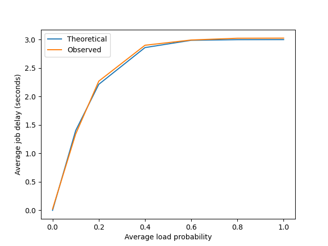
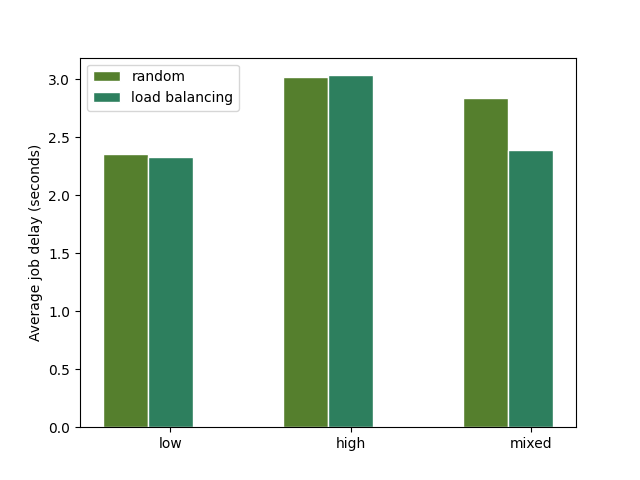

# System Design

In accordance with the requirements of the assignment, the system is broken up into three major components: the client, the server and the compute nodes.

The project is implemented in Python, the source for the client can be found in the `client.py` file. Likewise, the source for the server can be found in the `server.py` file and the source for the compute node can be found in the `computeNode.py` file.

At a high level, the system works by having the client initially submit a job to the server with a data directory and a list of files to process. Next, the server will take each of these files and create a task for each one, assigning each task to a random compute node. Under the "random" policy, each compute node will always accept the task and simply inject delay randomly depending on its "load probability". After processing the image, each compute node will write its result into the output directory. Once all tasks have completed, the server will return the elapsed time in seconds to the client. A more details description of the requirements and design of the system can be found in the Programming Assignment 1 PDF.

As mentioned earlier, the project is implemented in Python. Furthermore, the [Thrift](https://thrift.apache.org/) and [OpenCV](https://opencv.org/) libraries are used in the project. The project's Thrift objects are defined in the `service.thrift` file. This file contains a few structures and services, most notably the `ServerService` which defines the service the server implements which accepts a `Job` returning the elapsed time as a double, and the `ComputeService` which accept a `Task` and potentially throws a `TaskRejected` exception.

The compute node implementation is relatively straightforward. Under the "load" policy, the compute node will reject the task with probability equal to its load probability, which can be defined in the configuration file. Furthermore, if it accepts the task, it will inject delay again based on its load probability. The amount of delay injected can be specified in the configuation file. After injecting delay, the compute node will process the image by coloring it gray and applying the OpenCv Canny filter, writing the result to the output directory. 

The server implementation is slightly more involved. When the server recieves a job from the client, it will create a `Task` object for each file sent by the client. Then, it will create a seperate thread for each task where it will randomly assign the task to a given compute node. The list of compute nodes is given in the `machine.txt` file and parsed by the server. Once all of the tasks have been processed, the server returns the elapsed time in seconds to the client. 

The client implementation is also straightforward. First, the client will parse the `machine.txt` file to get the address of the server. Then, the client will collect all of the file names in the directory `PROJ_PATH/input_dir` where `PROJ_PATH` is provided as an environment variable or just the current working directory by default. Then, the client will create the job and submit it to the server. Furthermore, for testing purposes one can choose to have the client submit the same job multiple times by changing the `num_samples` field in the configuration file. The client will print out the total time it took for all the sample as well as the average time. 

# Operation & Usage

As mentioned above, there are two main files used for configuring the system: the `machine.txt` file which contains a list of nodes followed by their machine address and the `config.json` file which contains options for each of the node types. 

To run the project start by creating a Python virtual environment by typing
```bash
python3 -m venv ./venv
```
Next, activate the environment and install the required packages
```bash
source ./venv/bin/activate
pip install -r requirements.txt
```
Alternatively, one can install Thrift and OpenCV and set the environment variables `THRIFT_LIB_PATH` and `OPENCV_LIB_PATH` to point to your Thrift and OpenCV Python installation.

Next, one needs to generate the required Thrift files by either running the `thrift-gen.sh` shell script or running
```bash
mkdir -p gen
thrift -r --gen py -out gen service.thrift
```

Next, modify the `config.json` and `machine.txt` files depending on how the system is being ran. Entries in the `machine.txt` file follow the format `<node_type> <node_address>` where `node_type` is either `client`, `server` or `node_<node_num>` for compute nodes.

The compute nodes can be ran by executing 
```bash
python computeNode.py <node_num>
```
Where `node_num` ranges from 0 to the number of compute nodes minus one. 

Likewise, the server can be ran by executing 
```bash
python server.py
```
and the client can be ran by executing 
```bash
python client.py
```

## Assumptions Made & Grading

In order for the grading script provided for the assignment to work properly, there are a few key requirements that must be satisfied. Firstly, the `PROJ_PATH` environment variable should be set to the project directory if the files are being ran outside the default project directory. Furthermore, both directories `input_dir` and `output_dir` should be located in the `PROJ_PATH` directory, and the `machine.txt` file should also be located in the `PROJ_PATH` directory. Additionally, `THRIFT_LIB_PATH` should point to your Thrift installation. Because the project is using Python 3, make sure that `OPENCV_LIB_PATH` is set to `.../opencv/build/lib/python3` and not `.../opencv/build/lib` to ensure that OpenCv is installed correctly. Finally, because the project is using Python 3, make sure that each of the commands in the `commands.txt` file are using `python3` and not `python`.

# Test Cases & Expected Output

The shell script `test.sh` provides a convenient way to run and test the system. Using the default options provided in the `config.json` file and the default images in the data directory, one should expect an output similar to the output below 
```bash
[Compute 3] Initializing the compute handler with a load probability of 0.2, a load delay of 3 seconds and a compute policy of "random".
[Compute 0] Initializing the compute handler with a load probability of 0.2, a load delay of 3 seconds and a compute policy of "random".
[Compute 1] Initializing the compute handler with a load probability of 0.2, a load delay of 3 seconds and a compute policy of "random".
[Compute 0] Starting compute node...
[Compute 3] Starting compute node...
[Compute 1] Starting compute node...
[Compute 2] Initializing the compute handler with a load probability of 0.2, a load delay of 3 seconds and a compute policy of "random".
[Compute 2] Starting compute node...
[Server] Initializing server handler.
[Server] Starting server...
[Client] Submitting job to process images [starry_night.jpg, mask.png, HappyFish.jpg, baboon.jpg, squirrel_cls.jpg, fruits.jpg] in the directory ./data
[Server] Recieved job to process images [starry_night.jpg, mask.png, HappyFish.jpg, baboon.jpg, squirrel_cls.jpg, fruits.jpg] in the directory: ./data
[Compute 3] Recieved task to process the file "starry_night.jpg".
[Compute 3] Recieved task to process the file "mask.png".
[Compute 0] Recieved task to process the file "squirrel_cls.jpg".
[Compute 3] Recieved task to process the file "HappyFish.jpg".
[Compute 3] Injecting delay of 3 seconds.
[Compute 3] Recieved task to process the file "baboon.jpg".
[Compute 3] Injecting delay of 3 seconds.
[Compute 0] Recieved task to process the file "fruits.jpg".
[Compute 3] Finished processing "mask.png".
[Compute 0] Finished processing "squirrel_cls.jpg".
[Compute 0] Finished processing "fruits.jpg".
[Compute 3] Finished processing "starry_night.jpg".
[Compute 3] Finished processing "HappyFish.jpg".
[Compute 3] Finished processing "baboon.jpg".
[Server] Finished processing job in 3.0239341259002686 seconds.
[Client] Server finished processing job in 3.0239341259002686 seconds.
[Client] Finished processing the job 1 times in 3.0239341259002686 seconds for an average delay of 3.0239341259002686 seconds.
```
The completion time of the system may differ from run to run, but the output should be similar and the process images should be present in the output directory. Likewise, one can also test to make sure the system can properly handle increasing the number of job samples. In the `config.json` file modify `num_samples` in the client options to be `10`. The output after making this change should look similar to the output below
```bash
[Compute 3] Initializing the compute handler with a load probability of 0.2, a load delay of 3 seconds and a compute policy of "random".
[Compute 1] Initializing the compute handler with a load probability of 0.2, a load delay of 3 seconds and a compute policy of "random".
[Compute 1] Starting compute node...
...
[Server] Finished processing job in 3.008856773376465 seconds.
[Client] Server finished processing job in 3.008856773376465 seconds.
[Client] Finished processing the job 10 times in 24.172236680984497 seconds for an average delay of 2.41722366809845 seconds.
```
Furthermore, one can test to ensure that the system properly injects delay. To do this, modify the `load_probs` to be `[1.0, 1.0, 1.0, 1.0]` in the compute options in the `config.json` file. After making these changes, one should expect to see delay injected once for each image
```bash
...
[Server] Recieved job to process images [starry_night.jpg, mask.png, HappyFish.jpg, baboon.jpg, squirrel_cls.jpg, fruits.jpg] in the directory: ./data
[Compute 2] Recieved task to process the file "starry_night.jpg".
[Compute 2] Injecting delay of 3 seconds.
[Compute 1] Recieved task to process the file "baboon.jpg".
[Compute 1] Injecting delay of 3 seconds.
[Compute 2] Recieved task to process the file "HappyFish.jpg".
[Compute 2] Injecting delay of 3 seconds.
[Compute 2] Recieved task to process the file "squirrel_cls.jpg".
[Compute 1] Recieved task to process the file "mask.png".
[Compute 2] Injecting delay of 3 seconds.
[Compute 1] Injecting delay of 3 seconds.
[Compute 1] Recieved task to process the file "fruits.jpg".
[Compute 1] Injecting delay of 3 seconds.
...
```
Finally, one can also test that the system properly handles the "load" compute policy by chaing the `compute_policy` to "load" in the configuation file. After changing the compute policy to "load", one should expect that eventually a compute node will reject a task, but regardless the job will still be fully carried out.
```bash
...
[Compute 2] Recieved task to process the file "fruits.jpg".
[Compute 2] Injecting delay of 3 seconds.
[Compute 2] Recieved task to process the file "squirrel_cls.jpg".
[Server] Compute node 3 rejected the task.
[Server] Compute node 3 rejected the task.
[Compute 2] Recieved task to process the file "starry_night.jpg".
[Compute 2] Load exceeded, rejecting task.
[Server] Compute node 3 rejected the task.
[Server] Compute node 2 rejected the task.
...
```
# Performance Evaluation Results

Next, we will analyze the performance of the system theoretically and empirically. First, assume that we are using the "random" compute policy and suppose that there are N compute nodes with load probabilities p<sub>1</sub>, ..., p <sub>N</sub>. Suppose that the server assigns a compute node a task at random, then the probability that delay will be injected is just (1/N) &#8729; &#8721; p<sub>i</sub> since the server will select each compute node with equal probability (1/N). We note that this quantity is just the average load proability p<sub>A</sub>. Suppose that the server has M tasks to process, then the probability that none of the tasks have any delay injected is just (1-P<sub>A</sub>)<sup>M</sup>. Thus, the probability that at least one task has delay injected is 1-(1-P<sub>A</sub>)<sup>M</sup>. Given that in this instance communication and processing costs are minimal, delay is only added when at least one task has delay injected. Furthermore, since tasks are executed in parallel, the delay is identical in all cases where at least one node injects delay. Therefore, if each node randomly injects a delay of T seconds, the expected or average delay for all the M tasks to complete is T-T &#8729; (1-P<sub>A</sub>)<sup>M</sup>.

Now, we will consider the case when we use the "load" compute policy. We will again consider the case when the server submits a single task to a given compute node. Now, the probability that a compute node will reject a task is (1/N) &#8729; &#8721; p<sub>i</sub> which is also just P<sub>A</sub>. Likewise, let P<sub>D</sub> be the probability that a node accepts a task, but injects delay. Then we have that P<sub>D</sub>=(1/N) &#8729; &#8721; p<sub>i</sub>(1-p<sub>i</sub>). Given that the server will randomly select another node if a node rejects a task, the probability that a task will have delay associated with it is the probability that the task is immedietly accepted and delay is injected, plus the probability that it is initially rejected and then accepted with delay injected, plus the probability that is is rejected twice and then accepted with delay injected, and so fourth. Thus, the probability that a task has delay associated with it is the sum &sum;P<sub>A</sub><sup>k</sup>P<sub>D</sub> from k=1 to &infin; which is just P<sub>D</sub> / (1-P<sub>A</sub>). Similar to the random case, we have that the average delay for M tasks is T-T(1-(P<sub>D</sub>/(1-P<sub>A</sub>)))<sup>M</sup>.

Using the expected delays derived above, we can plot the expected versus the observed job delay in the system.



The plot above shows the observed and expected average job delay over 100 trials for 6 images under the "random" policy for varying average load proabilities. Note that in our derivation above only P<sub>A</sub> is relevant under the random compute policy. Clearly, the observed and expected delays are very close which shows that the assumptions made in the theoretical analysis are likely fairly accurate. 

Another interesting analysis is to consider cases with low load proabilities, high load probabilities and mixed load probabilities. Below is a plot of the average job delay over 100 trials for 6 images under both the "random" and "load" policies under varying loads. Low consisted of load proabilities of (0.2, 0.2, 0.2, 0.2), high consisted of load probabilities of (0.8, 0.8, 0.8, 0.8) and mixed consisted of load probabilities of (0.1, 0.5, 0.2, 0.9).



Based on our theoretical analysis, the results in the plot above are expected. We expect that the low load proability should have a average delay of 2.214 seconds under the random policy. Likewise, we expect that the high load proability should have an average delay of 2.999 seconds under the random policy. Furthermore, our analysis tells us that when the load probabilties are identical, the delay under "random" and "load" should be identical because if p<sub>i</sub>=p for all i, then P<sub>D</sub>/(1-P<sub>A</sub>)=p(1-p)/(1-p)=p implying that the average delay for load balancing is T-T(1-p) which is the same as the random policy. Intuitively, this result makes sense because when the load probabilities are the same, each node is equally loaded, implying that there is no advantage to load balancing, i.e. randomly assigning tasks is the best policy. This result agrees with our measured results since both low and medium loads have almost identical average delays under both the load balancing and random policies. Finally, under the mixed load we expect the average delay to be 2.892 seconds under the random policy and 2.493 seconds under the load balancing policy. These results again agree with the recorded times and here we see an instance where the load balancing policy outperforms the random policy.

