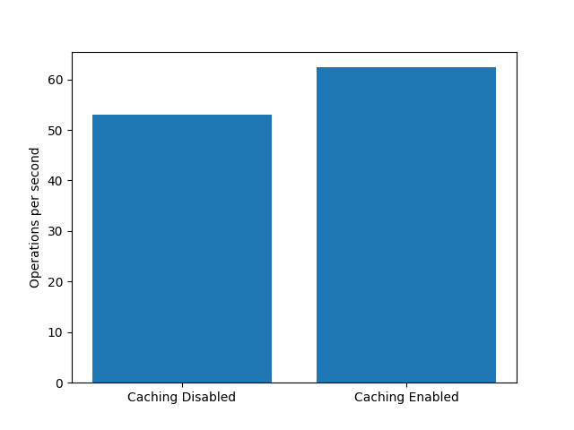

# System Design

For this programming assignment, the functionality of the system is is broken up into three major components: the client, the super node and the chord nodes.

The system is implemented in Python and makes use of the [Apache Thrift](https://thrift.apache.org/) RPC library for communication between nodes in the system. The source for the client can be found in the `client.py` file. Furthermore, the source for the super node can be found in the `supernode.py` file and the source for the chord node can be found in the `chordnode.py` file. The corresponding Thrift objects are defined in the `service.thrift` file.

A significant portion of the logic in the system is derived from the work presented in the original [Chord](https://pdos.csail.mit.edu/papers/chord:sigcomm01/chord_sigcomm.pdf) paper. That is, each chord node is assigned a unique id and for each key the successor (the node with the smallest id greater than or equal to the given key) is responsible for storing the value for the key. When a chord node joins the system, it locates its predecessor and successor to update their successor and predecessor accordingly. Furthermore, it also notifies all nodes in the system that may need to update their finger tables. When performing an insert or lookup, each node will recurisvely call other chord nodes in the system by using its finger table until the destination node is located. Once the destination node is located, either the insertion takes place or the value for the key is forwarded back to the original caller. The super node in this system merely acts as an entry point in to the DHT for the client and manages nodes joining the DHT, ensuring that only one node is joining the DHT at any given point in time. Likewise, the clients in the system are the nodes that initiate operations to read or update the conents of the DHT.

 As mentioned earlier, the implementation of the chord node in the system relies heavily on the work in the original Chord paper. In this sytem, each chord node is assigned an id according to its assigned domain name (e.g. `kh4250-11.cselabs.umn.edu`, `237.52.76.142` or `127.0.0.1`) and port (e.g. `8080`). Its id is obtained by taking the SHA256 hash of `<ip>:<port>` and discarding some of the higher bits depending on the key size provided in the configuration file. The implementation details for joining the DHT and performing operations are very similar to the details presented in the Chord paper, with a few subtle differences. Most notably, when updating finger tables, the new node n, contacts pred(n - 2<sup>i</sup>+1) instead of pred(n - 2 <sup>i</sup>) in the rare instance that n - 2 <sup>i</sup> is actually a node in the system. However, in practice the likelihood of a node with this key being present in the system is very unlikely with large key sizes. When a node initially request to join the system, it makes a request to the super node for a reference to an existing node in the DHT. In the event that the super node throws a `DHTBusy` exception, the node will wait a certain amount of time according to the sleep delay before attempting to request another node. After successfully receiving an existing node in the DHT, if the node is the empty node then the node initializes its successor and all entries in its finger table to reference itself. Otherwise, the node will use the entry node to find its successor and predecessor and subsequently make calls to them to update their predecessor and successor. Furthermore, it will initialize its finger table and update all nodes whose finger tables may need to be updated. Finally, the node will make another call to the super node to notify it that the node has finished joining the DHT. Performing insertions and retrieving definitions is done by using the key for a given word and finding its successor using the finger table of each node. This process is descriped in depth in the original Chord paper. The key for a given word is obtained by simply taking its SHA256 hash and discarding the higher bits depending on the key size. 
 
As mentioned earlier, the only responsibility of the super node is to provide access into the DHT and coordinate nodes joining the DHT. As a result, its implementation is relatively straightforward. When a chord node makes a request to the super node to join the DHT, the super node first attempts to acquire a mutex. If the mutex could not be acquired, the super node will throw a `DHTBusy` exception. Otherwise, if the DHT is empty the super node will return an empty node information object, letting the chord node know that it is the first node in the DHT. If the DHT is not empty, the super node will return a random node from the list of nodes already in the DHT. In both cases, the super node will add the joining node to a list of nodes in the system. When a node makes a call to the super node to notify it that the node has finished joining the DHT, the mutex will be released, allowing other chord nodes to join the DHT. If a client makes a request to the super node for a chord node, the super node will simply randomly return a chord node in its list of chord nodes. 

The implementation for the client is also relatively straightforward. First, the client will make a request to the super node to receive a reference to a node in the DHT. After receiving a reference to a chord ndoe in the DHT, it will subsequently execute each of the commands provided in the configuration file. There are four client commands. The `get` command accepts one argument which is the word to retrieve the definition. For example, the command `get foo` will retrieve the definition for the word `foo` and output it to the console. Likewise, the `put` command accepts a word and a definition as arguments. For example, the command `put foo cat` will store `cat` as the definition for `foo`. The `store` command accepts a text file as its only argument which contains words and definitions provided in the format seen in the `dictionary.txt` file. An insertion will be made into the DHT for each word and definition in the provided file. For example, the command `store dictionary.txt` will insert each word and its corresponding definition from the file `dictionary.txt` into the DHT. Finally, the `load` command accepts a text file which contains a list of words seperated by a new line. Furthermore, it optionally accepts a second argument which is the destination file to store the definitions for each word found in the DHT. The `load` command also outputs the definitions to console. For example, the command `load dictionary_words.txt defs.txt` will load the definitions for each word in `dictionary_words.txt` and store the definitions into the file `defs.txt`.

# Operation & Usage

To run the system, start by initializing a python virtual environment by running 
```bash
source create-env.sh
```
in the root directory of the project. Alternatively, one can create the Python virtual environment by running
```bash
python3 -m venv venv
source venv/bin/activate
pip install -r requirements.txt
```

Next, one needs to generate the required Thrift files by either running
```bash
source thrift-gen.sh
```
or by running
```bash
mkdir -p gen
thrift -r --gen py -out gen service.thrift
```

After creating the virtual environment and generating the Thrift files, the system can be ran by running
```
python run.py <config file>
```
If a configuration file is not passed to `run.py` then the default configuration file `config.json` will be used. 

Below is an example configuration file for the system 
```json
{
    "debug": true,
    "caching": true,
    "num_bits": 32,
    "sleep_delay": 1,
    "reuse_connection": true,
    "client_commands": [
        "store dictionary.txt",
        "get TRYSTER",
        "put cat foo",
        "put dog bar",
        "get PHORONE",
        "get banana",
        "put mouse baz",
        "get cat",
        "get dog",
        "get mouse",
        "load dictionary_words.txt dictionary_defs.txt"
    ],
    "super_node": {
        "ip": "kh4250-01.cselabs.umn.edu",
        "port": 8080
    },
    "chord_nodes": [
        {
            "ip": "kh4250-02.cselabs.umn.edu",
            "port": 8081
        },
        {
            "ip": "kh4250-03.cselabs.umn.edu",
            "port": 8082
        },
        {
            "ip": "kh4250-04.cselabs.umn.edu",
            "port": 8083
        },
        {
            "ip": "kh4250-05.cselabs.umn.edu",
            "port": 8084
        },
        {
            "ip": "kh4250-06.cselabs.umn.edu",
            "port": 8085
        }
    ]
}
```
A description of the dehavior of each of the configuration options are given below.

The `debug` option prints out additional information about requests being made when set to `true`.

The `caching` option, when set to `true`, caches definitions for word on multiple nodes. For example, if a client makes a request to insert a definition for a word and the request travels along the path `6 -> 20 -> 57 -> 134` then nodes `6, 20` and `57` will also store the definition in addition to node `134`. As seen later in this document, enabling decreases the delay for subsequent `get` operations because more than just the assigned node will have the definition for the word. 

The `num_bits` option specifies the number of bits that should be used for each key. This value should be no higher than around `60` because larger integers are unable to be sent over RPC using Thrift. Furthermore, it should be noted that using a smaller number of bits may create issues because of hash collisions. 

The `sleep_delay` option specifies the number of seconds that nodes should wait while joining the DHT before requesting to join again after receiving a `DHTBusy` exception. 

The `reuse_connection` option, when set to `true`, uses the same chord node when executing each client command. When this option is set to `false`, the client connects to a new chord node for each client command. Note that for the `load` and `store` commands, the client actually connects to a new chord node for each `word` in the corresponding files. 

The `client_commands` option is a list of strings representing client commands that the client executed. A description for each of the four client commands was provided earlier. 

The `super_node` option is simply an object which contains the address and port of the super node. If the address is `127.0.0.1` then the `run.py` script will run the super node client locally by creating a new process. Otherwise, the run script will SSH into the address provided with the user being the current user running the script. Then, the run script will activate the virtual environment and start the super node remotely. 

The `chord_nodes` option is a list of objects that contain the address and port of each chord node. Similar to the super node, if the address is `127.0.0.1` then the `run.py` script will run the chord node locally by creating a new process. Otherwise, the run script will SSH into the target server, activate the virtual environment and start the chord node remotely. 

It is important to note that the `run.py` script should always be ran in the root of the project directory. Furthermore, in the project directory path should be identical across all node servers. It is important that the Python virtual environment should be present in the `venv` folder, and the thrift files should be generated into the `gen` folder. 

# Test Cases & Expected Output

In the `configs` directory there are several configuration files used for testing the system. To run the system with any of these configuration files, simply provide the location to the configuration file as the only argument to the run script. For example, execute `python run.py configs/test_basic` to use the basic configuration. 

## Test Case 1: Basic Functionality

As an initial test case, we expect the system to function properly under very simple scenarios. Using the configuration file `configs/test_basic.json` which disables caching and connection reuse, we expect that the system provides an output similar to to the output below

```
Starting the super node.
Waiting for super node to start...
[Super Node] Starting server...
Starting chord node 0 (127.0.0.1:8081).
Starting chord node 1 (127.0.0.1:8082).
Starting chord node 2 (127.0.0.1:8083).
Starting chord node 3 (127.0.0.1:8084).
Starting chord node 4 (127.0.0.1:8085).
Waiting for DHT to be constructed...
[Chord Node 5662] Requesting a join node from super node.
[Chord Node 15209] Requesting a join node from super node.
[Chord Node 47694] Requesting a join node from super node.
[Chord Node 16421] Requesting a join node from super node.
[Super Node] Node 127.0.0.1:8082 has requested to join the DHT.
[Super Node] Attempting to acquire the DHT mutex.
[Super Node] DHT is empty, returning empty NodeInfo to 127.0.0.1:8082
[Chord Node 5662] Successfully received a join node from super node.
...
[Chord Node 58223] The DHT is busy, sleeping...
[Chord Node 5662] Updating predecessor from 5662 to 15209.
[Chord Node 5662] Updating successor from 5662 to 15209
[Chord Node 15209] Finger table initialized to ['(15210,5662)', '(15211,5662)', '(15213,5662)', '(15217,5662)', '(15225,5662)', '(15241,5662)', '(15273,5662)', '(15337,5662)', '(15465,5662)', '(15721,5662)', '(16233,5662)', '(17257,5662)', '(19305,5662)', '(23401,5662)', '(31593,5662)', '(47977,5662)'].
[Chord Node 15209] Forwarding request to find the predecessor of 15209 to 127.0.0.1:8082 (5662).
[Chord Node 5662] Key 15209 is in the range (5662, 15209], returning current node info as the predecessor.
[Chord Node 15209] Forwarding request to find the predecessor of 15208 to 127.0.0.1:8082 (5662).
[Chord Node 5662] Key 15208 is in the range (5662, 15209], returning current node info as the predecessor.
[Chord Node 5662] Updating finger table entry 2 from 5662 to 15209
...
[Client] Word "cat" has definition: "foo".
[Client] Retrieving definition for word "dog" from the DHT.
[Super Node] Returning node for client.
[Chord Node 15209] Retrieving definition for word "dog" (25549)
[Chord Node 15209] Forwarding request to retrieve definition for word "dog" (25549) to 127.0.0.1:8084 (16421)
[Chord Node 16421] Retrieving definition for word "dog" (25549)
[Chord Node 16421] Forwarding request to retrieve definition for word "dog" (25549) to 127.0.0.1:8083 (47694)
[Chord Node 47694] Retrieving definition for word "dog" (25549)
[Chord Node 47694] Word found in table "dog" (25549) to be "bar", returning result.
[Client] Word "dog" has definition: "bar".
[Client] Retrieving definition for word "mouse" from the DHT.
[Super Node] Returning node for client.
[Chord Node 47694] Retrieving definition for word "mouse" (50503)
[Chord Node 47694] Forwarding request to retrieve definition for word "mouse" (50503) to 127.0.0.1:8085 (58223)
[Chord Node 58223] Retrieving definition for word "mouse" (50503)
[Chord Node 58223] Word found in table "mouse" (50503) to be "baz", returning result.
[Client] Word "mouse" has definition: "baz".
[Client] Finished executing 6 commands in 0.008942842483520508 seconds.
Shutting down processes...
```

As seen above, the system behaves as expected. The DHT is initialized properly and the corresponding definitions for `cat`, `dot` and `mouse` where found to be `foo`, `bar` and `baz`. Furthermore, the nodes are stored and retrieved from the correct node.

## Test Case 2: Dictionary Files

As a slightly more involved test case, we expect that the client should be able to insertion definitions from a dictionary file into the DHT and load definitions from a word list from the DHT. Using the configuration file `configs/test_dict.json` we expect an output similar to the output below


```
...
[Client] Inserting word "ROCHELIME" with definition "Lime in the lump after it is burned; quicklime. [Eng.]" into the DHT.
[Chord Node 2132820005] Associating "ROCHELIME" (2234987387) with definition "Lime in the lump after it is burned; quicklime. [Eng.]".
[Chord Node 2132820005] Forwarding request to insert "ROCHELIME" (2234987387) with definition "Lime in the lump after it is burned; quicklime. [Eng.]" to 127.0.0.1:8085 (2519982959).
[Chord Node 2519982959] Associating "ROCHELIME" (2234987387) with definition "Lime in the lump after it is burned; quicklime. [Eng.]".
[Chord Node 2519982959] Word "ROCHELIME" (2234987387) inserted with definition "Lime in the lump after it is burned; quicklime. [Eng.]".
[Client] Inserting word "SALICYLIC" with definition "Pertaining to, derived from, or designating, an acid formerly obtained by fusing salicin with potassium hydroxide, and now made in large quantities from phenol (carbolic acid) by the action of carbon dioxide on heated sodium phenolate. It is a white crystalline substance. It is used as an antiseptic, and in its salts in the treatment of rheumatism. Called also hydroxybenzoic acid." into the DHT.
[Chord Node 2132820005] Associating "SALICYLIC" (3626083264) with definition "Pertaining to, derived from, or designating, an acid formerly obtained by fusing salicin with potassium hydroxide, and now made in large quantities from phenol (carbolic acid) by the action of carbon dioxide on heated sodium phenolate. It is a white crystalline substance. It is used as an antiseptic, and in its salts in the treatment of rheumatism. Called also hydroxybenzoic acid.".
...
[Client] Word "VOCIFERATION" has definition: "The act of vociferating; violent outcry; vehement utterance of the voice. Violent gesture and vociferation naturally shake the hearts of the ignorant. Spectator. Plaintive strains succeeding the vociferations of emotion or of pain. Byron.".
[Chord Node 2132820005] Retrieving definition for word "WEEVILY" (3143602188)
[Chord Node 2132820005] Forwarding request to retrieve definition for word "WEEVILY" (3143602188) to 127.0.0.1:8085 (2519982959)
[Chord Node 2519982959] Retrieving definition for word "WEEVILY" (3143602188)
[Chord Node 2519982959] Forwarding request to retrieve definition for word "WEEVILY" (3143602188) to 127.0.0.1:8081 (36780905)
[Chord Node 36780905] Retrieving definition for word "WEEVILY" (3143602188)
[Chord Node 36780905] Word found in table "WEEVILY" (3143602188) to be "Having weevils; weeviled. [Written also weevilly.]", returning result.
[Client] Word "WEEVILY" has definition: "Having weevils; weeviled. [Written also weevilly.]".
[Chord Node 2132820005] Retrieving definition for word "WORDER" (1316791232)
[Chord Node 2132820005] Word found in table "WORDER" (1316791232) to be "A speaker. [Obs.] Withlock.", returning result.
[Client] Word "WORDER" has definition: "A speaker. [Obs.] Withlock.".
[Client] Finished loading definitions from word list file "dictionary_words.txt".
[Client] Writing loaded definitions to destination file "dictionary_defs.txt".
[Client] Finished executing 5 commands in 0.11611533164978027 seconds.
Shutting down processes...
```

Furthermore, the file `dictionary_defs.txt` should be present in the project directory. Upon running `diff dictionary dictionary_defs.txt` one should see that the two files are identical. 

## Test Case 3: Error Handling

The next test case is to ensure that the system is able to gracefully handle certain errors. More specifically, if the client attempts to retrieve the definition for a word that does not exist, a `WordNotFound` exception should be thrown. Furthermore, if caching is enabled and the client attempts to update a word, then a `DuplicateWord` word exception should be thrown. After running the system using the configuration file `configs/test_error.json` we expect an output similar to the output below

```
...
[Client] Inserting word "mouse" with definition "fizz" into the DHT.
[Chord Node 15209] Associating "mouse" (50503) with definition "fizz".
[Chord Node 15209] Error, word "mouse" (50503) is already present in the DHT.
[Client] Error, word "mouse" is already in the DHT.
[Client] Inserting word "mouse" with definition "buzz" into the DHT.
[Chord Node 15209] Associating "mouse" (50503) with definition "buzz".
[Chord Node 15209] Error, word "mouse" (50503) is already present in the DHT.
[Client] Error, word "mouse" is already in the DHT.
[Client] Retrieving definition for word "mouse" from the DHT.
[Chord Node 15209] Retrieving definition for word "mouse" (50503)
[Chord Node 15209] Word found in table "mouse" (50503) to be "baz", returning result.
[Client] Word "mouse" has definition: "baz".
[Client] Retrieving definition for word "fish" from the DHT.
[Chord Node 15209] Retrieving definition for word "fish" (29876)
[Chord Node 15209] Forwarding request to retrieve definition for word "fish" (29876) to 127.0.0.1:8084 (16421)
[Chord Node 16421] Retrieving definition for word "fish" (29876)
[Chord Node 16421] Forwarding request to retrieve definition for word "fish" (29876) to 127.0.0.1:8083 (47694)
[Chord Node 47694] Retrieving definition for word "fish" (29876)
[Chord Node 47694] Error, word "fish" (29876) was not found in the DHT.
[Client] Word "fish" has no definition associated to it.
[Client] Finished executing 10 commands in 0.006342887878417969 seconds.
Shutting down processes...
```

As we can see, the system correctly notifies the client if a word is already present in the DHT and if a definition is not present. 

## Test Case 4: Remote Execution

This test aims to show that the system works across multiple machines just as well as it does locally. By sshing into the keller lab machines and using the configuration file `configs/test_remote.json` we expect an output similar to the output below

```
Starting the super node.
Waiting for super node to start...
Starting chord node 0 (kh4250-12.cselabs.umn.edu:8081).
Starting chord node 1 (kh4250-13.cselabs.umn.edu:8082).
Starting chord node 2 (kh4250-14.cselabs.umn.edu:8083).
Starting chord node 3 (kh4250-15.cselabs.umn.edu:8084).
Starting chord node 4 (kh4250-16.cselabs.umn.edu:8085).
Waiting for DHT to be constructed...
[Chord Node 124585511] Requesting a join node from super node.
[Chord Node 124585511] Successfully received a join node from super node.
[Chord Node 124585511] DHT is empty, initializing first node.
[Chord Node 124585511] Initialized chord node server...
...
[Chord Node 3905356469] Updating finger table entry 22 from 124585511 to 4042622808
[Chord Node 3905356469] Finger table updated to: ['(3905356470,4042622808)', '(3905356471,4042622808)', '(3905356473,4042622808)', '(3905356477,4042622808)', '(3905356485,4042622808)', '(3905356501,4042622808)', '(3905356533,4042622808)', '(3905356597,4042622808)', '(3905356725,4042622808)', '(3905356981,4042622808)', '(3905357493,4042622808)', '(3905358517,4042622808)', '(3905360565,4042622808)', '(3905364661,4042622808)', '(3905372853,4042622808)', '(3905389237,4042622808)', '(3905422005,4042622808)', '(3905487541,4042622808)', '(3905618613,4042622808)', '(3905880757,4042622808)', '(3906405045,4042622808)', '(3907453621,4042622808)', '(3909550773,124585511)', '(3913745077,124585511)', '(3922133685,124585511)', '(3938910901,124585511)', '(3972465333,124585511)', '(4039574197,124585511)', '(4173791925,124585511)', '(147260085,1364676736)', '(684130997,1364676736)', '(1757872821,3236208289)']
[Chord Node 3905356469] Key 4038428505 is in the range (3905356469, 4042622808], returning current node info as the predecessor.
[Chord Node 3905356469] Updating finger table entry 23 from 124585511 to 4042622808
...
[Chord Node 3236208289] Retrieving definition for word "TRYSTER" (2274984792)
[Chord Node 3236208289] Word found in table "TRYSTER" (2274984792) to be "One who makes an appointment, or tryst; one who meets with another.", returning result.
[Chord Node 3236208289] Retrieving definition for word "UNCORRUPTION" (2806567764)
[Chord Node 3236208289] Word found in table "UNCORRUPTION" (2806567764) to be "Incorruption.", returning result.
[Chord Node 3236208289] Retrieving definition for word "UNRULIMENT" (3089093613)
[Client] Word "UNRULIMENT" has definition: "Unruliness. [Obs.] "Breaking forth with rude unruliment." Spenser.".
[Client] Word "VARTABED" has definition: "A doctor or teacher in the Armenian church. Members of this order of ecclesiastics frequently have charge of dioceses, with episcopal functions.".
[Client] Word "VOCIFERATION" has definition: "The act of vociferating; violent outcry; vehement utterance of the voice. Violent gesture and vociferation naturally shake the hearts of the ignorant. Spectator. Plaintive strains succeeding the vociferations of emotion or of pain. Byron.".
[Client] Word "WEEVILY" has definition: "Having weevils; weeviled. [Written also weevilly.]".
[Client] Word "WORDER" has definition: "A speaker. [Obs.] Withlock.".
[Client] Finished loading definitions from word list file "dictionary_words.txt".
[Client] Writing loaded definitions to destination file "dictionary_defs.txt".
[Client] Finished executing 11 commands in 1.399690866470337 seconds.
Shutting down processes...
Shutting down remote proccesses...
```

As we can see the system still behaves correctly when running the system across several different machines. It should be noted that the output above is not completely accurate because not all of the output is forwarded over SSH, but indeed we see that the definitions are inserted and retrieved correctly. Furthermore, if you get the error 
```
OSError: [Errno 98] Address already in use
```
this likely means that other programs are already being ran on a machine with a conflicting port. To fix this, simply set the address of the nodes to different machines.

## Test Case 5: Single Node DHT

Clearly, we should expect that the system works with any number of nodes, including a single node. Running the program with the confirugation file `configs/test_single.json` should display an output similar to the output below

```
Starting the super node.
Waiting for super node to start...
[Super Node] Starting server...
Starting chord node 0 (127.0.0.1:8081).
Waiting for DHT to be constructed...
[Chord Node 15209] Requesting a join node from super node.
[Super Node] Node 127.0.0.1:8081 has requested to join the DHT.
[Super Node] Attempting to acquire the DHT mutex.
[Super Node] DHT is empty, returning empty NodeInfo to 127.0.0.1:8081
[Chord Node 15209] Successfully received a join node from super node.
[Chord Node 15209] DHT is empty, initializing first node.
[Chord Node 15209] Initialized chord node server...
[Super Node] Recieved join event, releasing the DHT mutex.
[Client] Connecting to the super node.
[Super Node] Returning node for client.
[Client] Connecting to chord node 15209 with address 127.0.0.1:8081.
[Client] Inserting word "cat" with definition "foo" into the DHT.
[Chord Node 15209] Associating "cat" (44919) with definition "foo".
[Chord Node 15209] Word "cat" (44919) inserted with definition "foo".
[Client] Inserting word "dog" with definition "bar" into the DHT.
[Chord Node 15209] Associating "dog" (25549) with definition "bar".
[Chord Node 15209] Word "dog" (25549) inserted with definition "bar".
[Client] Inserting word "mouse" with definition "baz" into the DHT.
[Chord Node 15209] Associating "mouse" (50503) with definition "baz".
[Chord Node 15209] Word "mouse" (50503) inserted with definition "baz".
[Client] Retrieving definition for word "cat" from the DHT.
[Chord Node 15209] Retrieving definition for word "cat" (44919)
[Chord Node 15209] Word found in table "cat" (44919) to be "foo", returning result.
[Client] Word "cat" has definition: "foo".
[Client] Retrieving definition for word "dog" from the DHT.
[Chord Node 15209] Retrieving definition for word "dog" (25549)
[Chord Node 15209] Word found in table "dog" (25549) to be "bar", returning result.
[Client] Word "dog" has definition: "bar".
[Client] Retrieving definition for word "mouse" from the DHT.
[Chord Node 15209] Retrieving definition for word "mouse" (50503)
[Chord Node 15209] Word found in table "mouse" (50503) to be "baz", returning result.
[Client] Word "mouse" has definition: "baz".
[Client] Finished executing 6 commands in 0.0024886131286621094 seconds.
Shutting down processes...
```

Obviously, only using one chord node defeats the purpose of using a DHT, but we should expect that the system behaves correctly when only one node is in the system.

## Test Case 6: DHT Updates

Finally, we expect that the DHT correctly handles updates when caching is disabled. Using the configuration file `configs/test_update.json` we expect an output similar to the output below

```
...
[Chord Node 47694] Associating "cat" (44919) with definition "foo".
[Chord Node 47694] Word "cat" (44919) inserted with definition "foo".
[Client] Inserting word "dog" with definition "bar" into the DHT.
[Chord Node 47694] Associating "dog" (25549) with definition "bar".
[Chord Node 47694] Word "dog" (25549) inserted with definition "bar".
[Client] Inserting word "mouse" with definition "baz" into the DHT.
[Chord Node 47694] Associating "mouse" (50503) with definition "baz".
[Chord Node 47694] Forwarding request to insert "mouse" (50503) with definition "baz" to 127.0.0.1:8085 (58223).
[Chord Node 58223] Associating "mouse" (50503) with definition "baz".
[Chord Node 58223] Word "mouse" (50503) inserted with definition "baz".
[Client] Inserting word "mouse" with definition "buzz" into the DHT.
[Chord Node 47694] Associating "mouse" (50503) with definition "buzz".
[Chord Node 47694] Forwarding request to insert "mouse" (50503) with definition "buzz" to 127.0.0.1:8085 (58223).
[Chord Node 58223] Associating "mouse" (50503) with definition "buzz".
[Chord Node 58223] Word "mouse" (50503) inserted with definition "buzz".
[Client] Inserting word "mouse" with definition "cheese" into the DHT.
[Chord Node 47694] Associating "mouse" (50503) with definition "cheese".
[Chord Node 47694] Forwarding request to insert "mouse" (50503) with definition "cheese" to 127.0.0.1:8085 (58223).
[Chord Node 58223] Associating "mouse" (50503) with definition "cheese".
[Chord Node 58223] Word "mouse" (50503) inserted with definition "cheese".
[Client] Finished executing 5 commands in 0.003169536590576172 seconds.
```

As we can see, with caching disabled, the system handles updates correctly.

# Performance Analysis: Caching

An mentioned above, caching may be used in a DHT to increase performance. We can measure this increase emperically by measuring the operation throughput of our system both when caching is disabled and enabled. Furthermore, to simulate a realistic scenario connection reused is disabled in attempt to mimic what would actually happen when thousands of clients are constantly inserting into the DHT. The configuration files `configs/test_cache.json` and `configs/test_nocache.json` correspond to enabling and disabling caching. 



After running the system on the Keller machines, I found that it took 3.3903 seconds without caching and 2.8856 seconds with caching to both store and load 90 words. Thus, the throughput without caching is about 53 operations per second and with caching is 62 operations per second. Thus, caching leads to a considerable 16% increase in throughput. The results are also shown in the figure above. 
